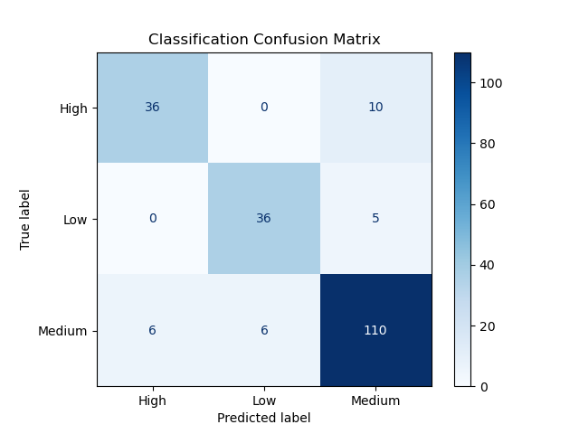
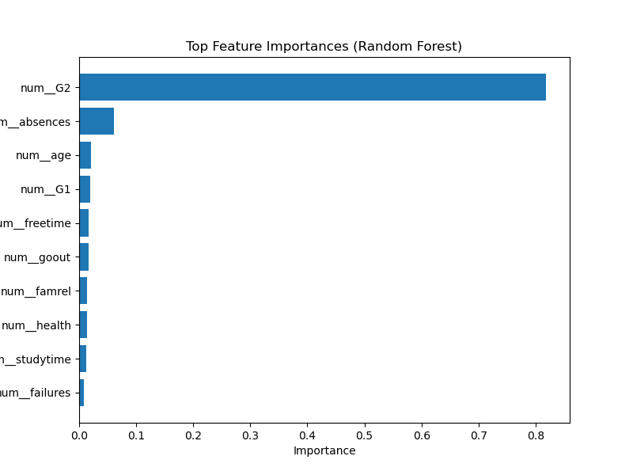

# 🎓 Student Academic Risk Prediction System

A full-stack Machine Learning application that predicts a student's final academic performance and risk level using behavioral, academic, and lifestyle features.

This project demonstrates the **complete ML lifecycle**:

- Data preprocessing
- Feature engineering
- Model training
- Model evaluation
- Model interpretation
- Model deployment via a Flask web application

The system predicts:

- **Final Grade (Regression)**
- **Academic Risk Level (Classification)**

and provides insights into model performance and feature importance through an interactive dashboard.

## 📌 Problem Statement

Educational institutions often struggle to identify students who are at risk of academic underperformance until it is too late.

This project aims to build a **machine learning system capable of predicting student performance early**, enabling educators to:

- Identify students at risk
- Understand key factors influencing academic outcomes
- Provide early academic interventions

## 📊 Dataset

The project uses the **Student Performance Dataset** from the UCI Machine Learning Repository.

Dataset contains student attributes such as:

- Demographics
- Study habits
- Family background
- Social behavior
- Previous academic performance

Key variables include:

| Feature | Description |
|------|------|
| G1 | First period grade |
| G2 | Second period grade |
| absences | Number of school absences |
| studytime | Weekly study time |
| failures | Number of past class failures |
| famrel | Family relationship quality |
| freetime | Free time after school |
| goout | Social activity level |
| health | Current health status |

Target variables:

- **G3** → Final grade (Regression)
- **Risk Level** → High / Medium / Low (Classification)

## ⚙️ Feature Engineering Challenge

The original dataset contained **30+ features** including multiple categorical variables.

During early development, the prediction system required users to input **all features**, which made the web interface impractical.

### Problem
The deployed model required many features that users would realistically not provide.

### Solution

Feature importance analysis using **Random Forest** revealed that a small subset of variables dominated predictive power.

Top influential features included:

- G2 (Second period grade)
- G1 (First period grade)
- absences
- studytime
- failures

The feature set was reduced to **10 key variables**, allowing the model to remain accurate while making the user interface significantly more practical.

This step improved:

- usability
- model interpretability
- deployment feasibility

## 🤖 Machine Learning Models

Two supervised learning models were trained.

### Regression Model
Predicts the student's **final grade (G3)**.

Models evaluated:

- Linear Regression
- Random Forest Regressor

Random Forest provided the best performance.

### Classification Model
Predicts **student academic risk level**.

Risk categories:

- High Risk
- Medium Risk
- Low Risk

Models evaluated:

- Logistic Regression
- Random Forest Classifier

## 📈 Model Performance

### Regression Results

| Model | Train R² | Test R² |
|------|------|------|
| Linear Regression | 0.837 | 0.828 |
| Random Forest | 0.977 | **0.886** |

Random Forest was selected for deployment due to superior predictive accuracy.

---

### Classification Results

| Metric | Score |
|------|------|
Accuracy | **0.852**
F1 Score (Macro) | **0.839**

The classifier demonstrates strong performance across all risk categories.

### Confusion Matrix

The confusion matrix illustrates the classification performance across the three risk categories.

## 🔍 Model Insights

Random Forest feature importance analysis reveals which variables most influence predictions.

The most important predictors are:

1. Second period grade (G2)
2. Absences
3. First period grade (G1)
4. Study time
5. Family relationship quality

## 🌐 Web Application

The machine learning models are deployed using **Flask**.

Users can input student information through a web interface and receive:

- Predicted final grade
- Academic risk level

### Key Features

- Real-time prediction
- Color-coded risk indicator
- Model performance dashboard
- Feature importance insights

## 🏗 Project Architecture

project/
│
├── app.py
├── config.py
│
├── models/
│   ├── regression_pipeline.pkl
│   ├── classification_pipeline.pkl
│
├── routes/
│   ├── predict_routes.py
│   ├── metrics_routes.py
│   ├── insights_routes.py
│
├── services/
│   ├── model_loader.py
│   ├── predictor.py
│
├── training/
│   └── train_models.py
│
├── static/
│   └── images/
│
└── templates/

## 🛠 Tech Stack

Machine Learning:
- Python
- Scikit-Learn
- Pandas
- NumPy

Visualization:
- Matplotlib

Backend:
- Flask

Frontend:
- HTML
- CSS
- JavaScript

Deployment Ready:
- Modular Flask architecture

## 🚀 Future Improvements

Possible extensions include:

- Cross-validation based model tuning
- SHAP explainability integration
- Real-time student monitoring dashboard
- Deployment to cloud platforms (AWS / Vercel)

## 👨‍💻 Author

**Dinindu Kumarathilake**

Computer Science Undergraduate  
Aspiring Data Scientist

This project demonstrates practical experience in:

- Machine learning pipelines
- model evaluation
- full-stack ML deployment
- interpretable machine learning